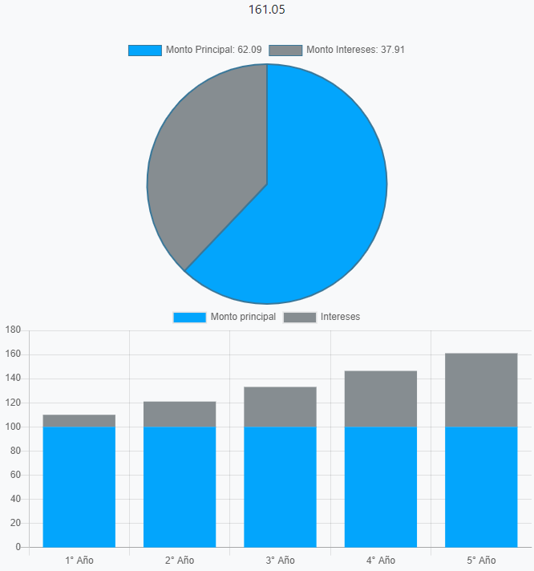

# compound-interest-calculator
Calculadora de interés compuesto diseñada para web.

Genera un resultado en base a datos ingresados por el usuario.

https://fonz626.github.io/compound-interest-calculator/
